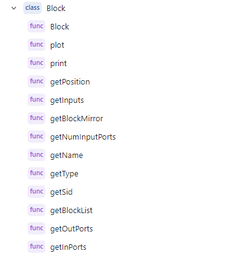
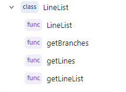
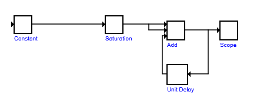

# Simulink Viewer
Simulink Viewer is a software tool that can read Simulink MDL files and display their contents in a user-friendly way using a Java-based graphical user interface (GUI).

## Motivation
The aim of this project is to develop a software tool that can read Simulink MDL files and display their contents in a user-friendly way using a Java-based graphical user interface (GUI). Simulink is a popular simulation and modeling environment used in various industries, including automotive, aerospace, and electronics. The Simulink MDL files contain the model information, which is used to simulate and analyze the system behavior.

The tool will provide users with the ability to load Simulink MDL files and view their contents in a hierarchical structure. The GUI will allow users to navigate through the model components and see their properties and connections. The tool will also enable users to interactively modify the model and visualize the changes in real-time.

The software will consist of two main components: a Simulink MDL file parser and a Java-based GUI. The parser will be responsible for reading the MDL file and extracting the model information, including the block diagram, parameters, and connections. The GUI will provide a user-friendly interface for displaying the model and enabling user interaction.

## Features
Key features of the software tool include:

- Loading and parsing Simulink MDL files
- Displaying the Simulink model in a hierarchical structure
- Navigating through the model components and seeing their properties and connections
- Interactively modifying the model and visualizing the changes in real-time

## Getting Started

### Prerequisites
- Java Development Kit (JDK) version 11 or higher.
- you will need to use `javafx` package for this project.

### Building the Project

- Clone the repository:
`git clone https://github.com/MariamH78/Simulink-Viewer.git`
- Navigate to the project directory:
`cd <your directory>`
or Open the project folder in your preferred IDE (e.g., Eclipse, IntelliJ IDEA).
- Run the `simple_smulink.java` file as a Java application or through the terminal:
`java simple_simulink.java` then you will need to write the `<name of your mdl file>`.
- note: if the mdl file doesn't exist in the same directory with the project you will need to
write the entire directory for your mdl file.

## Usage
To use the software, follow these steps:

- Launch the software by running the `simple_simulink.java` file as a Java application.
- Click on the `File` menu and select `Open` to browse for a Simulink MDL file on your computer.
- Select the MDL `file` you want to load and click `Open`.
- The software will parse the MDL file and display the Simulink model in a hierarchical structure on the left panel.
- You can expand or collapse the model components by clicking on the `+` or `-` icons next to them.

## Symbols

- Here are the sympols Block Class:

- Here are the sympols Line Class:

- Here are the sympols main Application:

## Example Output

Here is an example of the output generated by the SIMULINK Viewer:

This image demonstrates the hierarchical structure of a Simulink model.

## Contributors

- [Mariam Hesham Abd El-Hamid Hassan](https://github.com/MariamH78) 2000943 - Parsin Lines form the mdl file and Ploting them.

- [Waleed Khalid Mohamed Waleed Alzamil](https://github.com/WaleedAlzamil80) 2002011 - Parsing the Blocks from the mdl file and Ploting them.

## License
This project is not licensed under any License.

## Acknowledgements

We would like to express our gratitude to [Dr. Mahmoud Khalil](mahmoud.khalil@eng.asu.edu.eg) for his guidance and support throughout the development of this project. His expertise in advanced computer programming and his dedication to teaching have been invaluable to our learning experience in CSE231s-UG2018. We would also like to thank him for his prompt feedback and constructive criticism, which helped us improve our code and refine our problem-solving skills.
